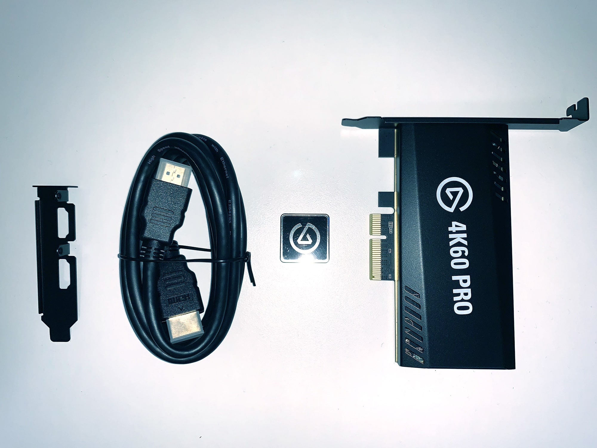
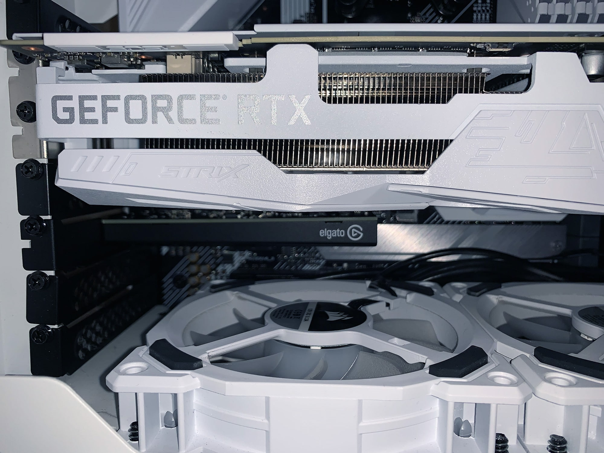
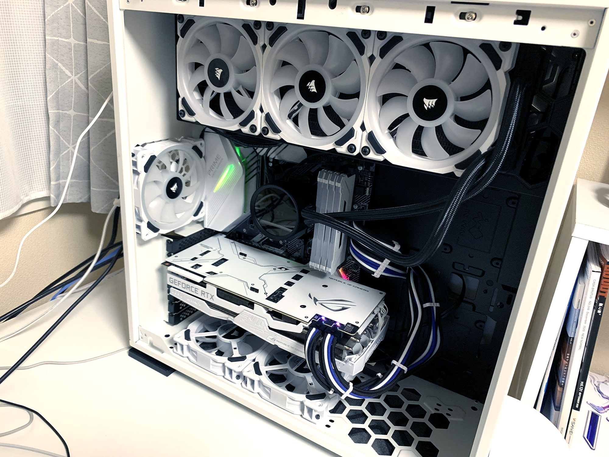

最近はあんまりしてなかったんだけど、僕はゲーム配信をするのが結構好きでがっつり環境を揃えていたりした。  
最近また熱が上がってきてまたいろんな問題を発見したのでそれに対応するために [4K60 Pro MK.2](https://www.amazon.co.jp/gp/product/B07VWXCXM7/) という製品を購入したのでそこらへんのお話を。

## キャプチャーボード遍歴

ゲーム機の映像・音声を PC に渡して録画・配信させる機器をキャプチャーボードと呼ぶわけですが、今回買った 4K60 Pro MK.2 に辿り着くまでに僕は3つのキャプチャーボードを経由している。

### Elgato Game Capture HD

ゲーム配信をやるぞとなって最初に買ったのは、 [Elgato Game Capture HD](https://www.amazon.co.jp/HD/dp/B0082J1YCE) で、確か  Wii の[ゼルダの伝説 スカイウォードソード](https://www.nintendo.co.jp/wii/souj/)を配信したくて買った記憶がある。  
当時は何も分からなくてググって最初に出た商品を買った記憶があるが、今思えば悪くない買い物だった気がする。使い続けた歴で言えばこの製品が一番長い。

ただもはや割と昔の製品なのでスペックは当然低くて、パススルーでフルHDで60FPSでプレイはできるが、撮影した映像はフルHD30FPSになってしまう。  
その後、この機器の上位機種を買ったので今は同僚に貸し出している。

### Elgato Game Capture HD60

次に使ったのが、 [Elgato Game Capture HD60](https://www.amazon.co.jp/dp/B00MIQ40JQ) という先ほど紹介した商品の上位機種。  
これは単純にフルHD60FPSで配信できるようなったというもの。あとは見た目もコンパクトになってデスクに置きやすくなった。

ただこれはなぜだか分からないけどソフトとの相性がよくなくて配信や録画に失敗することが多発して早々に使うのやめよう…となった。  
今は元同僚現友達に貸し出しているが、彼は元気に使ってくれているみたいで安心している。

### GV-USB3/HD

そして最近まで使っていたのが I-O DATA の [GV-USB3/HD](https://www.amazon.co.jp/gp/product/B075KHQ5GF) という製品。  
この辺りで Windows のゲーミングマシンを購入したので Windows のみ対応のキャプチャーボードも選択肢に入ってだいぶ広がった感がある。ただこの製品は前まで使っていたものよりもスペックが上がっているというわけではなく、そこは全く一緒。  
とりあえず動作が安定していれば問題なかったので、レビューで動作が安定していそうで Windows 対応のものを探していて見つけたので買ったという感じ。

これは本当になんのトラブルもなく使えていたので最近までしっかり活用していた。  
ただ見た目がだいぶゴツくてでかいのでデスクに置いておくと結構邪魔という小さな問題はあった。

### 4K60 Pro MK.2

そして今回購入したのが Elgato の [4K60 Pro MK.2](https://www.amazon.co.jp/gp/product/B07VWXCXM7) です。  
結局 Elgato に戻ってきた。キャプチャーボード界隈は Elgato と AVerMedia の二大巨頭って感じがあるけど AVerMedia は一度も触れなかった。

これについて詳しく書いていく。

## 4K60 Pro MK.2 導入の話

なぜまた新しくキャプチャーボードを買ったかというと2つの問題があった。

1つ目は、1年ほど前に自作した PC で USB の認識が不安定というのがあった。なぜか突然 USB で接続している端末の接続が切れるという事象がたびたび起こっていて、そもそもこの問題を解決する必要があるんだけど、原因はいくつか可能性がありそうな気配は見つけたけどまだ根本解決には至っていない。  
そこを根本解決するのは目指しつつももう1つの問題もあるのでもはやこれは USB 接続ではなくて、 PC に内臓するタイプのキャプチャーボードに変えた方が良さそうという気持ちになった。

2つ目は、これまで使っていたキャプチャーボードが4K60FPSに対応していないということ。  
最近は PS4 Pro でゲームをすることも多くて高画質高フレームレートの環境でゲームをしているのでどうせ録画・配信するなら高画質で見せたいという気持ちがあって(そうなるとネットワーク負荷が高いけどうちのネット環境は結構厳しいという別問題もあるが)、それに対応した機器を探していた。  
4K30FPSに対応していたり、パススルーは4K60FPSだけど配信では4K30FPSになっちゃうみたいなのはたくさんあったんだけど、4K60FPSでパススルー出力もできるし録画・配信もできるというのはあまり選択肢がなくて、特に迷わずにこれに決まった感じ。

4K60 Pro MK.2 のインターフェースは PCI-Express で僕の PC もスロットが余っていたのでちょうどよかった。

### 繋いでみる

箱はこんな感じ。


開けてみるとこんなん。


中身はこれが入ってる。



左から PC に取り付ける際の HDMI のインターフェース部分のマウンタの別サイズのやつと HDMI と と謎のステッカーっぽいやつと本体。

マザーボードにぶっ刺すとこんな感じ。



そもそもだいぶ小型なんだけどグラボがデカすぎて異常にちっちゃく見えてしまう。  
あとグラボに触れるギリギリという感じで温度が若干心配ではある。もう一段下のスロットに刺すこともできるけどそうするとケースファンが邪魔なのでケースファンの位置を変える必要がありそうでめんどくさいので一旦これでいく。

そして僕の PC は白で統一していてかっこいい。



ここまでやったら PC を起動して PS4 の HDMI を 4K60 Pro MK.2 に繋いでそこからさらに HDMI をモニターに刺して PS4 を起動してみた。そして OBS を起動してみて PS4 の設定を確認する。

無事に4K60FPSで出力できていることが確認できた。


OBS 側でも4K60FPSで認識できていた。多分。

## 配線の話

配信したいゲームのコンシューマ機としては PS4 と switch があって、どちらもシームレスに簡単に配信できるようにしたいという気持ちがあるので、ちょっと配線を工夫している。工夫していると言っても[この4K60HZ 対応の双方向の HDMI 切替器](https://www.amazon.co.jp/gp/product/B07LFRVQR2)を使っているだけという話だが、こんな感じで配線している。

```
PS4 Pro ━━━━━━┓
                  HDMI 切替器 ━━ PC ━━ モニター
Nintendo Switch ━┛
```

HDMI 切替器についているボタンを押すことで PS4 と switch を切り替えられるのでとても便利。  
ただこの図の配線をするだけで HDMI を4本使っているのでなかなかのなかなかである。

## おわり

まだ実際に配信はしていなくて起動確認だけなので、実際に配信してみないと本当に良いかどうかはまだなんとも言えないところ。今度やってみます。  
あとこれは前提として PS4 Pro じゃないといけなかったりするし、そもそもこのキャプチャーボードめっちゃ高いので、今のところまだおすすめはしないです。

ちなみに今更ですが PS4 のシェア機能での配信はフルHD30FPSでしかできないので画質にこだわるならキャプチャーボードは使うべきというのがあります。

配信やってみてよかったら「おすすめ〜〜〜〜ウヒョ〜〜〜〜」ってツイートします。おわり。
